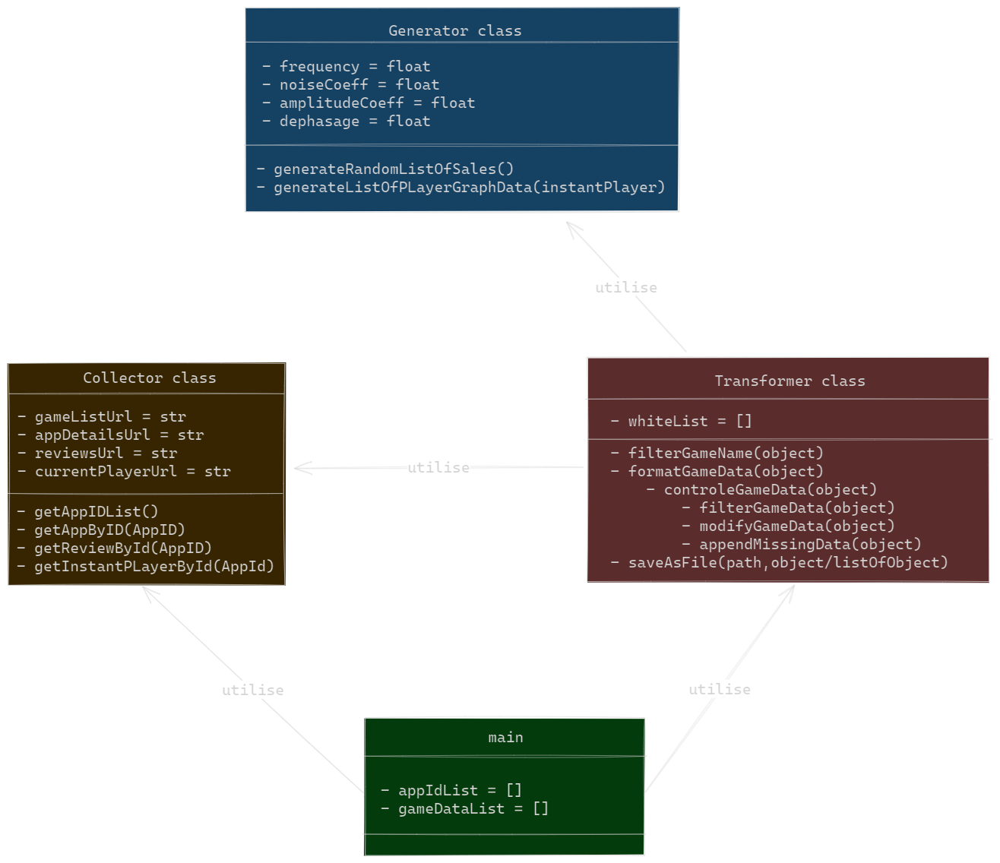

# BackEnd -- DashBoard

 

## 1 - Team 👥

> * Alexandre Clerc [@Lapin-Blanc-git](https://github.com/Lapin-Blanc-git)
> * Theau Margouty [@Ttheau748K](https://github.com/Ttheau748K)
> * Maxime Beaudoin [@Maxime Beaudoin](https://github.com/maxarasta)
> * Louis Mucha [@LouisMucha](https://github.com/LouisMucha)

 

## 2 - Link 🔗
[BackEnd](https://github.com/WebScrappingProjectESME/BackEnd) \  
[FrontEnd](https://github.com/WebScrappingProjectESME/Dash_frontend)

 

## 3 - Dependencies

- [ramda](https://ramdajs.com/)
- [Node.js](https://nodejs.org/en/download/) (which comes with [npm](http://npmjs.com)) installed on your computer.

## 4 - class Structure

